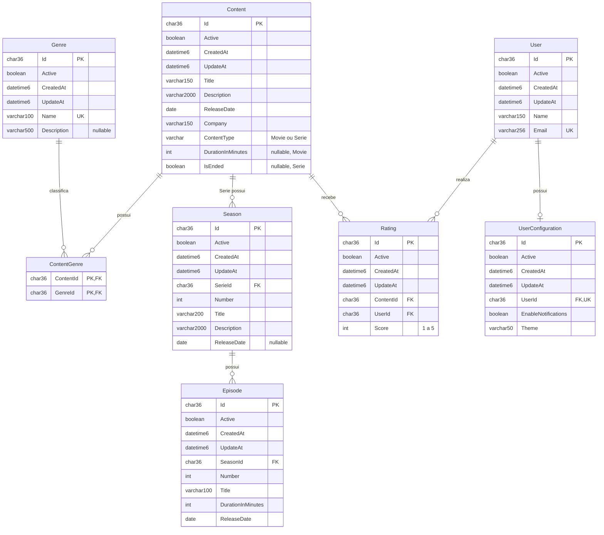

# Esquema físico — Recommenda

Banco MySQL `Recommenda`, criado pela migration `InitialCreate`. O modelo contém oito tabelas de domínio; `Movie` e `Serie` são subtipos armazenados em `Content` por TPH.

## Relacionamentos

`char36` representa `char(36)`; `datetime6` representa `datetime(6)`. A tabela de junção `ContentGenre` possui chave primária composta e não herda os campos de `BaseEntity`.

## Cardinalidade e opcionalidade

| Relação ou propriedade | Configuração |
| --- | --- |
| `Content` / `Genre` | N:N pela tabela `ContentGenre`, com duas FKs obrigatórias e PK composta. |
| `Serie` / `Season` | 1:N. Cada temporada pertence a uma série; uma série pode ter zero ou mais temporadas. A FK física aponta para `Content` por causa de TPH. |
| `Season` / `Episode` | 1:N. Cada episódio pertence a uma temporada; uma temporada pode ter zero ou mais episódios. |
| `Content` / `Rating` | 1:N, com `Rating.ContentId` obrigatório. |
| `User` / `Rating` | 1:N, com `Rating.UserId` obrigatório. |
| `User` / `UserConfiguration` | 1:0..1. Um usuário pode existir sem configuração; cada configuração pertence a exatamente um usuário. |
| `Genre.Description` | Opcional. |
| `Season.ReleaseDate` | Opcional, para temporadas sem data definida. |
| `Episode.ReleaseDate` | Obrigatória. |
| `Content.Company` | Obrigatória, com até 150 caracteres. |

Todas as entidades que herdam de `BaseEntity` possuem `Id`, `Active`, `CreatedAt` e `UpdateAt` obrigatórios. As FKs de relacionamento são obrigatórias nos respectivos dependentes.

## Herança TPH

O discriminador `ContentType` identifica `Movie` ou `Serie`. O mapeamento de filme exige `DurationInMinutes`, enquanto o de série exige `IsEnded`. Essas duas colunas ficam nullable na tabela compartilhada, pois cada uma pertence somente a um subtipo.

O banco garante que `Season.SerieId` referencia um registro de `Content`. A FK isoladamente não valida o discriminador; a associação ao subtipo `Serie` é representada pelo modelo do EF Core.

## Índices e restrições

| Tabela | Regra |
| --- | --- |
| `Genre` | `Name` único. |
| `User` | `Email` único. |
| `UserConfiguration` | `UserId` único, garantindo no máximo uma configuração por usuário. |
| `Season` | Par `(SerieId, Number)` único. |
| `Episode` | Par `(SeasonId, Number)` único. O mesmo número pode aparecer em temporadas diferentes. |
| `Rating` | Par `(UserId, ContentId)` único; constraint `Score BETWEEN 1 AND 5`. |
| `ContentGenre` | PK composta `(ContentId, GenreId)` evita vínculos duplicados; índice em `GenreId`. |

As FKs possuem índices conforme o modelo gerado pelo EF Core. A exclusão de uma série remove suas temporadas e episódios em cascata; a de um usuário remove configuração e avaliações. A exclusão de conteúdo remove suas avaliações e vínculos com gêneros. A exclusão de gênero remove seus vínculos em `ContentGenre`.

## Evolução em relação à referência da aula

O modelo preserva as entidades e relações de Recommenda. A entrega torna explícitas a junção N:N e as propriedades opcionais, alinha a descrição opcional de gênero no domínio e no banco, adiciona a restrição de notas de 1 a 5 e representa a configuração opcional do usuário. O histórico de três migrations usado durante as aulas é consolidado em uma única migration inicial, destinada à criação de um banco novo.

Os campos `ReleaseDate` mantêm `DateOnly` e `DateOnly?` no domínio e `date` no MySQL. Um `ValueConverter` na Infrastructure converte esses valores para `DateTime` durante o acesso ao driver, que devolve colunas `DATE` nesse formato. A leitura e escrita das três datas foram verificadas pelos testes de integração.
